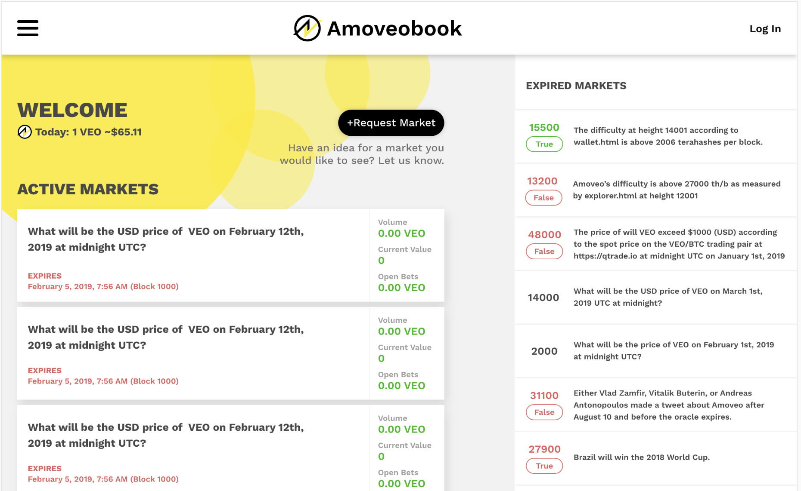

# Amoveo Book

World's first decentralized prediction market - https://amoveobook.com




## Why Amoveo

- **Off-chain smart contracts**: Speed with security guarantees
- **Minimal state**: Extremely scalable, sharding-ready architecture
- **Native oracles**: Built-in oracle system as core infrastructure
- **POW consensus**: Proven security model
- **Derivatives over sub-currencies**: Lower costs, smaller state

## Why Amoveobook

- **Front-running protection**: Orders matched in batches every X blocks
- **Decentralized resolution**: Trustless oracle-based settlement
- **Fast markets**: Quick resolution times
- **Speed & security**: Off-chain matching with on-chain guarantees

## Install

```bash
npm install
```

## Development

```bash
npm run dev
```

## Build

```bash
npm run build
npm run prod
```
